# LWGUI (Light Weight Shader GUI)

[中文](https://github.com/JasonMa0012/LWGUI/blob/dev/README_CN.md) | [English](https://github.com/JasonMa0012/LWGUI)

[](https://discord.gg/WwBYGXqPEh)

一个轻量, 灵活, 强大的 **Unity Shader GUI** 系统, 专为提升材质面板生产力而设计.

LWGUI 已在诸多大型商业项目中长期验证:  
使用简洁的 Material Property Drawer 语法快速搭建复杂 Inspector, 同时提供模块化 Drawer/Decorator 扩展体系、稳定的 MetaData 生命周期缓存、完善的 Ramp/Preset/Toolbar 工具链与 Timeline 集成能力.

在保证高扩展性的同时显著缩短开发迭代周期, 并大幅提升美术与技术美术的协作体验.

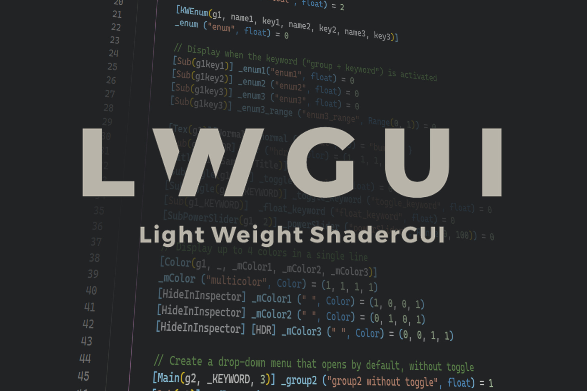

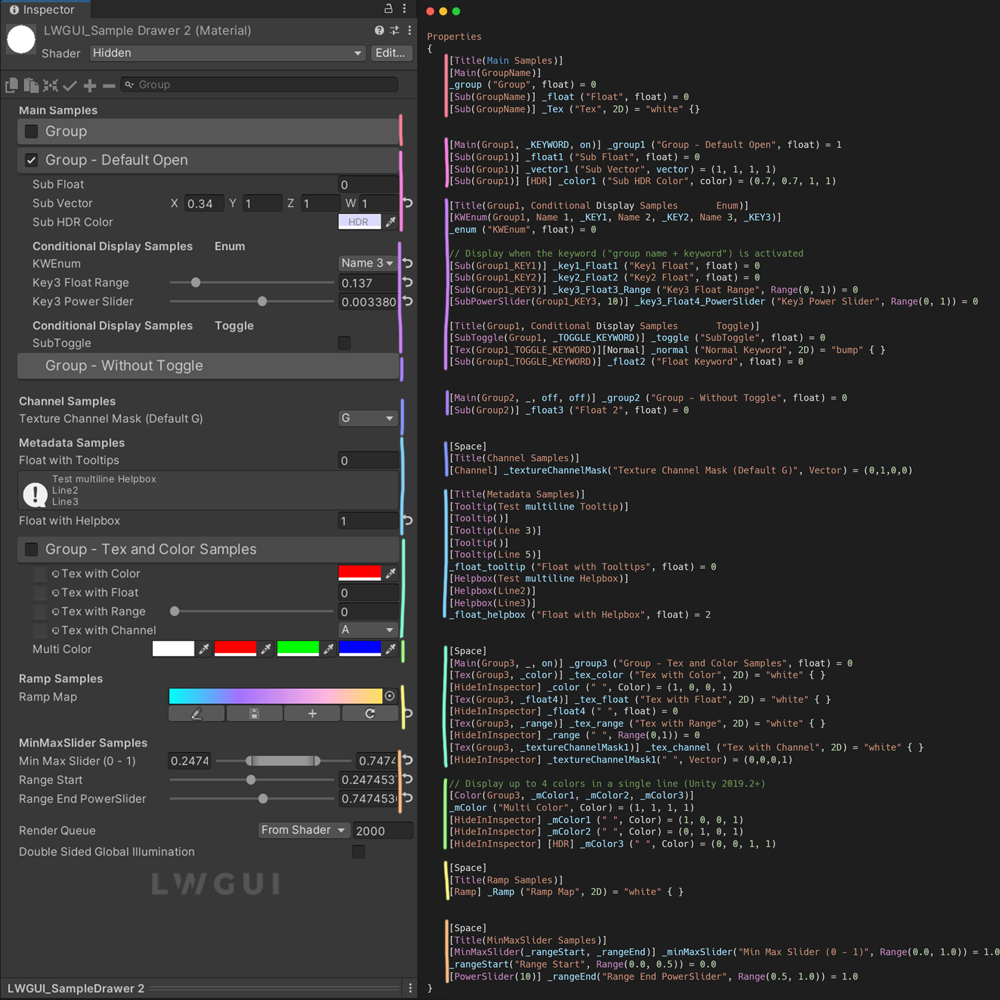

| 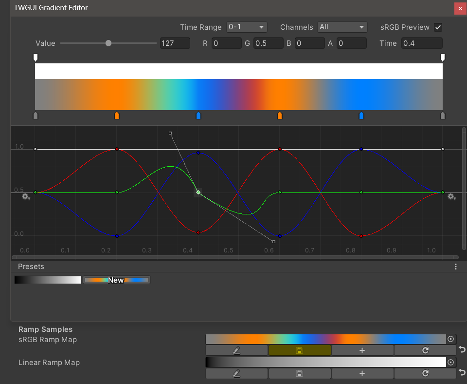                                     |                   |
| --------------------------------------------------------------------------------------------------- | --------------------------------------------------------------- |
| 比UE更加强大的Gradient编辑器, 同时支持Shader和C#                                                    | **NEW: 使用Ramp Atlas在一个Texture中包含多个Ramp**        |
| 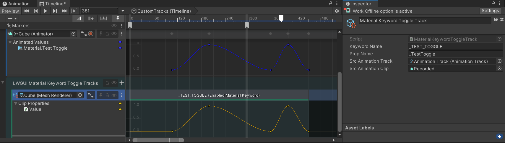                                     | 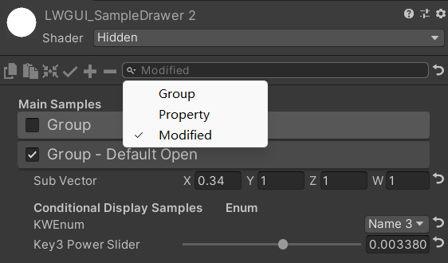 |
| **NEW: Timeline中录制材质参数动画时, 自动捕获Toggle的Keyword更改, 以便运行时切换材质Keyword** | 功能丰富的工具栏                                                |

| With your sponsorship, I will update more actively. | 有你的赞助我会更加积极地更新                                                              |
| --------------------------------------------------- | ----------------------------------------------------------------------------------------- |
| [paypal.me/JasonMa0012](paypal.me/JasonMa0012)         |  |

<!--ts-->

* [LWGUI (Light Weight Shader GUI)](#lwgui-light-weight-shader-gui)
  * [Installation](#installation)
  * [Getting Started](#getting-started)
  * [Basic Drawers](#basic-drawers)
    * [Main &amp; Sub](#main--sub)
  * [Extra Drawers](#extra-drawers)
    * [Numeric](#numeric)
      * [SubToggle](#subtoggle)
      * [SubPowerSlider](#subpowerslider)
      * [SubIntRange](#subintrange)
      * [MinMaxSlider](#minmaxslider)
      * [KWEnum](#kwenum)
      * [SubEnum &amp; SubKeywordEnum](#subenum--subkeywordenum)
      * [Preset](#preset)
        * [Create Preset File](#create-preset-file)
        * [Edit Preset](#edit-preset)
      * [BitMask](#bitmask)
      * [RampAtlasIndexer](#rampatlasindexer)
    * [Texture](#texture)
      * [Tex](#tex)
      * [Ramp](#ramp)
        * [ShaderLab](#shaderlab)
        * [C#](#c)
        * [Gradient Editor](#gradient-editor)
      * [RampAtlas](#rampatlas)
        * [Ramp Atlas Scriptable Object](#ramp-atlas-scriptable-object)
      * [Image](#image)
    * [Vector](#vector)
      * [Color](#color)
      * [Channel](#channel)
    * [Other](#other)
      * [Button](#button)
  * [Extra Decorators](#extra-decorators)
    * [Appearance](#appearance)
      * [Title &amp; SubTitle](#title--subtitle)
      * [Tooltip &amp; Helpbox](#tooltip--helpbox)
      * [ReadOnly](#readonly)
    * [Logic](#logic)
      * [PassSwitch](#passswitch)
    * [Structure](#structure)
      * [Advanced &amp; AdvancedHeaderProperty](#advanced--advancedheaderproperty)
    * [Condition Display](#condition-display)
      * [Hidden](#hidden)
      * [ShowIf](#showif)
  * [LWGUI Timeline Tracks](#lwgui-timeline-tracks)
    * [MaterialKeywordToggleTrack](#materialkeywordtoggletrack)
  * [Unity Builtin Drawers](#unity-builtin-drawers)
    * [Space](#space)
    * [Header](#header)
    * [Enum](#enum)
    * [IntRange](#intrange)
    * [KeywordEnum](#keywordenum)
    * [PowerSlider](#powerslider)
    * [Toggle](#toggle)
  * [FAQs](#faqs)
    * [在代码中修改材质后出现问题](#在代码中修改材质后出现问题)
    * [在代码中创建材质后出现问题](#在代码中创建材质后出现问题)
  * [Custom Shader GUI](#custom-shader-gui)
    * [Custom Header and Footer](#custom-header-and-footer)
    * [Custom Drawer](#custom-drawer)
  * [Contribution](#contribution)
  * [开发指南](#开发指南)

<!--te-->

## Installation

1. 确保你的Unity版本兼容LWGUI

   - LWGUI <1.17: **Unity 2017.4+**
   - LWGUI >=1.17: **Unity 2021.3+**
     - **推荐的最低版本: Unity 2022.2+, 更低版本虽然能使用但可能有BUG**
2. 打开已有工程
3. （可能需要全局代理）`Window > Package Manager > Add > Add package from git URL` 输入 `https://github.com/JasonMa0012/LWGUI.git`

   - 你也可以选择手动从Github下载Zip，然后从 `Package Manager > Add package from disk`添加Local Package
   - **对于Unity 2017, 请直接将Zip解压到Assets目录**

## Getting Started

1. 新建一个Shader或使用现有的Shader
2. 在代码编辑器中打开Shader
3. 在Shader最底部, 最后一个大括号之前, 添加行:`CustomEditor "LWGUI.LWGUI"`
4. 完成! 开始使用以下功能强大的Drawer轻松绘制你的ShaderGUI吧
   - MaterialPropertyDrawer是一种类似C# Attribute的语法, 在MaterialProperty前加上Drawer可以更改绘制方式, 更多信息可以查看[官方文档](https://docs.unity3d.com/ScriptReference/MaterialPropertyDrawer.html)
   - 你可以参考Test目录中的示例Shader
   - ***请注意: 每个Property只能有一个Drawer, 但是可以有多个Decorator***

## Basic Drawers

### Main & Sub

```c#
/// Create a Folding Group
/// 
/// group: group name (Default: Property Name)
/// keyword: keyword used for toggle, "_" = ignore, none or "__" = Property Name +  "_ON", always Upper (Default: none)
/// default Folding State: "on" or "off" (Default: off)
/// default Toggle Displayed: "on" or "off" (Default: on)
/// preset File Name: "Shader Property Preset" asset name, see Preset() for detail (Default: none)
/// Target Property Type: Float, express Toggle value
public MainDrawer() : this(String.Empty) { }
public MainDrawer(string group) : this(group, String.Empty) { }
public MainDrawer(string group, string keyword) : this(group, keyword, "off") { }
public MainDrawer(string group, string keyword, string defaultFoldingState) : this(group, keyword, defaultFoldingState, "on") { }
public MainDrawer(string group, string keyword, string defaultFoldingState, string defaultToggleDisplayed) : this(group, keyword, defaultFoldingState, defaultToggleDisplayed, String.Empty) { }
public MainDrawer(string group, string keyword, string defaultFoldingState, string defaultToggleDisplayed, string presetFileName)

```

```c#
/// Draw a property with default style in the folding group
/// 
/// group: parent group name (Default: none)
/// Target Property Type: Any
public SubDrawer() { }
public SubDrawer(string group)

```

Example:

```c#
[Title(Main Samples)]
[Main(GroupName)]
_group ("Group", float) = 0
[Sub(GroupName)] _float ("Float", float) = 0


[Main(Group1, _KEYWORD, on)] _group1 ("Group - Default Open", float) = 1
[Sub(Group1)] _float1 ("Sub Float", float) = 0
[Sub(Group1)] _vector1 ("Sub Vector", vector) = (1, 1, 1, 1)
[Sub(Group1)] [HDR] _color1 ("Sub HDR Color", color) = (0.7, 0.7, 1, 1)

[Title(Group1, Conditional Display Samples       Enum)]
[KWEnum(Group1, Name 1, _KEY1, Name 2, _KEY2, Name 3, _KEY3)]
_enum ("KWEnum", float) = 0

// Display when the keyword ("group name + keyword") is activated
[Sub(Group1_KEY1)] _key1_Float1 ("Key1 Float", float) = 0
[Sub(Group1_KEY2)] _key2_Float2 ("Key2 Float", float) = 0
[Sub(Group1_KEY3)] _key3_Float3_Range ("Key3 Float Range", Range(0, 1)) = 0
[SubPowerSlider(Group1_KEY3, 10)] _key3_Float4_PowerSlider ("Key3 Power Slider", Range(0, 1)) = 0

[Title(Group1, Conditional Display Samples       Toggle)]
[SubToggle(Group1, _TOGGLE_KEYWORD)] _toggle ("SubToggle", float) = 0
[Tex(Group1_TOGGLE_KEYWORD)][Normal] _normal ("Normal Keyword", 2D) = "bump" { }
[Sub(Group1_TOGGLE_KEYWORD)] _float2 ("Float Keyword", float) = 0


[Main(Group2, _, off, off)] _group2 ("Group - Without Toggle", float) = 0
[Sub(Group2)] _float3 ("Float 2", float) = 0

```

Default result:

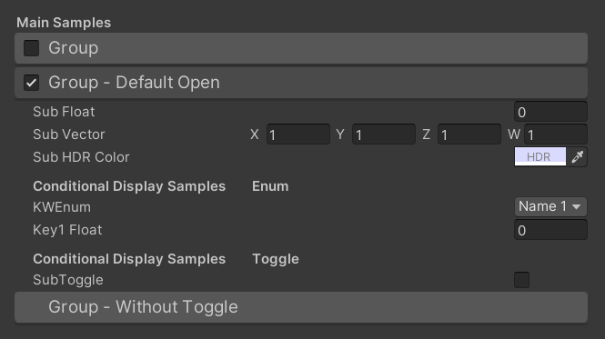

Then change values:

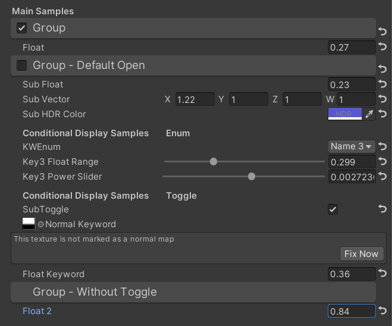

## Extra Drawers

### Numeric

#### SubToggle

```c#
/// Similar to builtin Toggle()
/// 
/// group: parent group name (Default: none)
/// keyword: keyword used for toggle, "_" = ignore, none or "__" = Property Name +  "_ON", always Upper (Default: none)
/// preset File Name: "Shader Property Preset" asset name, see Preset() for detail (Default: none)
/// Target Property Type: Float
public SubToggleDrawer() { }
public SubToggleDrawer(string group) : this(group, String.Empty, String.Empty) { }
public SubToggleDrawer(string group, string keyWord) : this(group, keyWord, String.Empty) { }
public SubToggleDrawer(string group, string keyWord, string presetFileName)
```

#### SubPowerSlider

```c#
/// Similar to builtin PowerSlider()
/// 
/// group: parent group name (Default: none)
/// power: power of slider (Default: 1)
/// presetFileName: "Shader Property Preset" asset name, it rounds up the float to choose which Preset to use.  
///    You can create new Preset by  
///    "Right Click > Create > LWGUI > Shader Property Preset" in Project window,  
///    *any Preset in the entire project cannot have the same name*
/// Target Property Type: Range
public SubPowerSliderDrawer(float power) : this("_", power) { }  
public SubPowerSliderDrawer(string group, float power) : this(group, power, string.Empty) { }  
public SubPowerSliderDrawer(string group, float power, string presetFileName)
```

#### SubIntRange

```c#
/// Similar to builtin IntRange()
/// 
/// group: parent group name (Default: none)
/// Target Property Type: Range
public SubIntRangeDrawer(string group)

```

#### MinMaxSlider

```c#
/// Draw a min max slider
/// 
/// group: parent group name (Default: none)
/// minPropName: Output Min Property Name
/// maxPropName: Output Max Property Name
/// Target Property Type: Range, range limits express the MinMaxSlider value range
/// Output Min/Max Property Type: Range, it's value is limited by it's range
public MinMaxSliderDrawer(string minPropName, string maxPropName) : this("_", minPropName, maxPropName) { }
public MinMaxSliderDrawer(string group, string minPropName, string maxPropName)

```

Example:

```c#
[Title(MinMaxSlider Samples)]
[MinMaxSlider(_rangeStart, _rangeEnd)] _minMaxSlider("Min Max Slider (0 - 1)", Range(0.0, 1.0)) = 1.0
/*[HideInInspector]*/_rangeStart("Range Start", Range(0.0, 0.5)) = 0.0
/*[HideInInspector]*/[PowerSlider(10)] _rangeEnd("Range End PowerSlider", Range(0.5, 1.0)) = 1.0

```

Result:

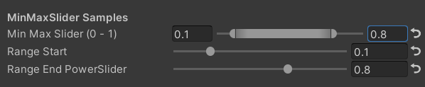

#### KWEnum

```c#
/// Similar to builtin Enum() / KeywordEnum()
/// 
/// group: parent group name (Default: none)
/// n(s): display name
/// k(s): keyword
/// v(s): value
/// Target Property Type: Float, express current keyword index
public KWEnumDrawer(string n1, string k1)
public KWEnumDrawer(string n1, string k1, string n2, string k2)
public KWEnumDrawer(string n1, string k1, string n2, string k2, string n3, string k3)
public KWEnumDrawer(string n1, string k1, string n2, string k2, string n3, string k3, string n4, string k4)
public KWEnumDrawer(string n1, string k1, string n2, string k2, string n3, string k3, string n4, string k4, string n5, string k5)
  
public KWEnumDrawer(string group, string n1, string k1)
public KWEnumDrawer(string group, string n1, string k1, string n2, string k2)
public KWEnumDrawer(string group, string n1, string k1, string n2, string k2, string n3, string k3)
public KWEnumDrawer(string group, string n1, string k1, string n2, string k2, string n3, string k3, string n4, string k4)
public KWEnumDrawer(string group, string n1, string k1, string n2, string k2, string n3, string k3, string n4, string k4, string n5, string k5)
```

#### SubEnum & SubKeywordEnum

```c#
// enumName: like "UnityEngine.Rendering.BlendMode"
public SubEnumDrawer(string group, string enumName) : base(group, enumName)

public SubEnumDrawer(string group, string n1, float v1, string n2, float v2)
public SubEnumDrawer(string group, string n1, float v1, string n2, float v2, string n3, float v3)
public SubEnumDrawer(string group, string n1, float v1, string n2, float v2, string n3, float v3, string n4, float v4)
public SubEnumDrawer(string group, string n1, float v1, string n2, float v2, string n3, float v3, string n4, float v4, string n5, float v5)
public SubEnumDrawer(string group, string n1, float v1, string n2, float v2, string n3, float v3, string n4, float v4, string n5, float v5, string n6, float v6)
public SubEnumDrawer(string group, string n1, float v1, string n2, float v2, string n3, float v3, string n4, float v4, string n5, float v5, string n6, float v6, string n7, float v7)


public SubKeywordEnumDrawer(string group, string kw1, string kw2)
public SubKeywordEnumDrawer(string group, string kw1, string kw2, string kw3)
public SubKeywordEnumDrawer(string group, string kw1, string kw2, string kw3, string kw4)
public SubKeywordEnumDrawer(string group, string kw1, string kw2, string kw3, string kw4, string kw5)
public SubKeywordEnumDrawer(string group, string kw1, string kw2, string kw3, string kw4, string kw5, string kw6)
public SubKeywordEnumDrawer(string group, string kw1, string kw2, string kw3, string kw4, string kw5, string kw6, string kw7)
public SubKeywordEnumDrawer(string group, string kw1, string kw2, string kw3, string kw4, string kw5, string kw6, string kw7, string kw8)
public SubKeywordEnumDrawer(string group, string kw1, string kw2, string kw3, string kw4, string kw5, string kw6, string kw7, string kw8, string kw9)

```

#### Preset

```c#
/// Popping a menu, you can select the Shader Property Preset, the Preset values will replaces the default values
/// 
/// group: parent group name (Default: none)
///	presetFileName: "Shader Property Preset" asset name, you can create new Preset by
///		"Right Click > Create > LWGUI > Shader Property Preset" in Project window,
///		*any Preset in the entire project cannot have the same name*
/// Target Property Type: Float, express current keyword index
public PresetDrawer(string presetFileName) : this("_", presetFileName) {}
public PresetDrawer(string group, string presetFileName)

```

Example:

```c#
[Title(Preset Samples)]
[Preset(LWGUI_BlendModePreset)] _BlendMode ("Blend Mode Preset", float) = 0 
[Enum(UnityEngine.Rendering.CullMode)]_Cull("Cull", Float) = 2
[Enum(UnityEngine.Rendering.BlendMode)]_SrcBlend("SrcBlend", Float) = 1
[Enum(UnityEngine.Rendering.BlendMode)]_DstBlend("DstBlend", Float) = 0
[Toggle(_)]_ZWrite("ZWrite ", Float) = 1
[Enum(UnityEngine.Rendering.CompareFunction)]_ZTest("ZTest", Float) = 4 // 4 is LEqual
[Enum(RGBA,15,RGB,14)]_ColorMask("ColorMask", Float) = 15 // 15 is RGBA (binary 1111)
  
``````
  
Cull [_Cull]
ZWrite [_ZWrite]
Blend [_SrcBlend] [_DstBlend]
ColorMask [_ColorMask]
```

Result:

选择的预设内的属性值将成为默认值:

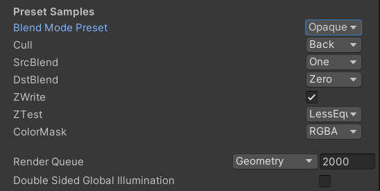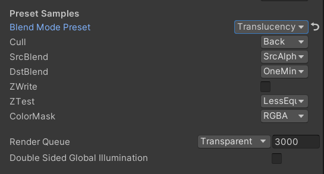

##### Create Preset File

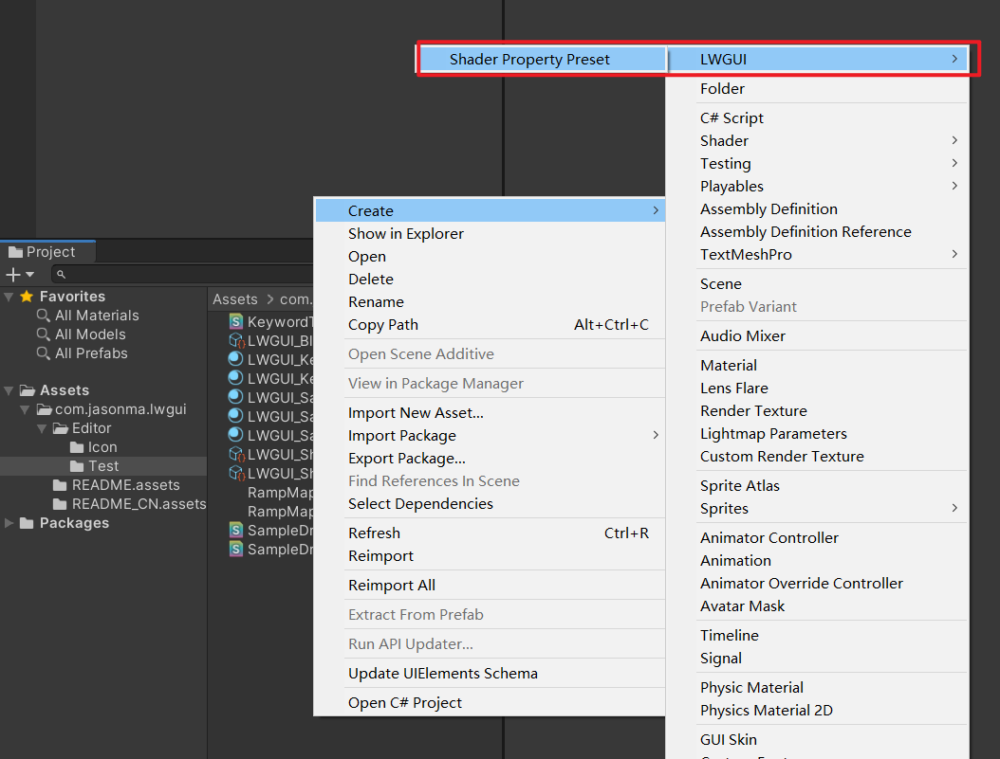

##### Edit Preset

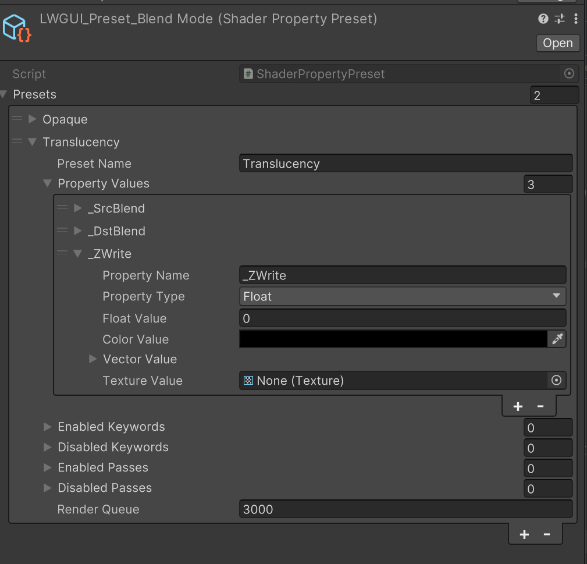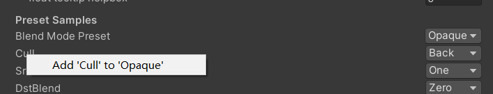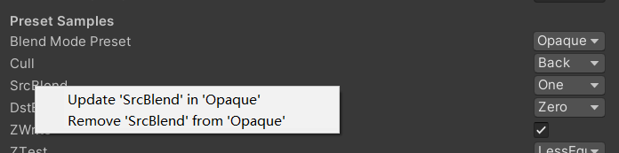

#### BitMask

```C#
/// Draw the Int value as a Bit Mask.
/// Note:
///    - Currently only 8 bits are supported.
///
/// Warning 1: If used to set Stencil, it will conflict with SRP Batcher!  
///		(Reproduced in Unity 2022)  
///		SRP Batcher does not correctly handle multiple materials with different Stencil Ref values,  
///		mistakenly merging them into a single Batch and randomly selecting one material's Stencil Ref value for the entire Batch.  
///		In theory, if different materials have different Stencil Ref values, they should not be merged into a single Batch due to differing Render States.  
/// Solution:  
///		- Force disable SRP Batcher by setting the Material Property Block  
///		- Place materials with the same Stencil Ref value in a separate Render Queue to ensure the Batch's Render State is correct
///
/// Warning 2: Once in use, do not change the Target Property Type!
///		The underlying type of Int Property is Float Property, and in Materials, Int and Integer are stored separately.  
///		Once a Material is saved, the Property Type is determined.  
///		If you change the Property Type at this point (such as switching between Int/Integer), some strange bugs may occur.  
///		If you must change the Property Type, it is recommended to modify the Property Name as well or delete the saved Property in the material.
/// group: parent group name (Default: none)
/// bitDescription 7-0: Description of each Bit. (Default: none)
/// Target Property Type: Int
public BitMaskDrawer() : this(string.Empty, null) { }
public BitMaskDrawer(string group) : this(group, null) { }
public BitMaskDrawer(string group, string bitDescription7, string bitDescription6, string bitDescription5, string bitDescription4, string bitDescription3, string bitDescription2, string bitDescription1, string bitDescription0) 
    : this(group, new List<string>() { bitDescription0, bitDescription1, bitDescription2, bitDescription3, bitDescription4, bitDescription5, bitDescription6, bitDescription7 }) { }

```

Example:

```C#
[BitMask(Preset)] _Stencil ("Stencil", Integer) = 0  
[BitMask(Preset, Left, Bit6, Bit5, Bit4, Description, Bit2, Bit1, Right)] _StencilWithDescription ("Stencil With Description", Integer) = 0
```

Result:


> [!CAUTION]
> 警告: 如果用于设置Stencil, 则会与SRP Batcher冲突!
> (在Unity 2022中复现)
>
> SRP Batcher没有正确处理含有不同Stencil Ref的多个材质,
> 错误地将它们合并为一个Batch, 并随机选择一个材质中的Stencil Ref值作为整个Batch的值.
> 理论上如果不同材质有不同的Stencil Ref值, 由于Render State不同不应该被合并为一个Batch.
>
> 解决方法:
>
> - 通过设置Material Property Block强制禁用SRP Batcher
> - 使有相同Stencil Ref的材质在一个单独的Render Queue中, 以确保Batch的Render State是正确的

#### RampAtlasIndexer

```c#
/// 视觉上类似Ramp(), 但RampAtlasIndexer()必须和RampAtlas()一起使用.  
/// 实际保存的值为当前Ramp在Ramp Atlas SO中的Index, 用于在Shader中采样Ramp Atlas Texture.  
///  
/// group: parent group name.  
/// rampAtlasPropName: RampAtlas() property name.  
/// defaultRampName: default ramp name. (Default: Ramp)  
/// colorSpace: default ramp color space. (sRGB/Linear) (Default: sRGB)  
/// viewChannelMask: editable channels. (Default: RGBA)  
/// timeRange: the abscissa display range (1/24/2400), is used to optimize the editing experience when the abscissa is time of day. (Default: 1)  
/// Target Property Type: Float
public RampAtlasIndexerDrawer(string group, string rampAtlasPropName) : this(group, rampAtlasPropName, "Ramp") {}  
public RampAtlasIndexerDrawer(string group, string rampAtlasPropName, string defaultRampName) : this(group, rampAtlasPropName, defaultRampName, "sRGB") {}  
public RampAtlasIndexerDrawer(string group, string rampAtlasPropName, string defaultRampName, string colorSpace) : this(group, rampAtlasPropName, defaultRampName, colorSpace, "RGBA") {}  
public RampAtlasIndexerDrawer(string group, string rampAtlasPropName, string defaultRampName, string colorSpace, string viewChannelMask) : this(group, rampAtlasPropName, defaultRampName, colorSpace, viewChannelMask, 1) {}  
public RampAtlasIndexerDrawer(string group, string rampAtlasPropName, string defaultRampName, string colorSpace, string viewChannelMask, float timeRange)  
```

用法详见: RampAtlas()

### Texture

#### Tex

```c#
/// Draw a Texture property in single line with a extra property
/// 
/// group: parent group name (Default: none)
/// extraPropName: extra property name (Default: none)
/// Target Property Type: Texture
/// Extra Property Type: Color, Vector
/// Target Property Type: Texture2D
public TexDrawer() { }
public TexDrawer(string group) : this(group, String.Empty) { }
public TexDrawer(string group, string extraPropName)

```

Example:

```c#
[Main(Group3, _, on)] _group3 ("Group - Tex and Color Samples", float) = 0
[Tex(Group3, _color)] _tex_color ("Tex with Color", 2D) = "white" { }
[HideInInspector] _color (" ", Color) = (1, 0, 0, 1)
[Tex(Group3, _textureChannelMask1)] _tex_channel ("Tex with Channel", 2D) = "white" { }
[HideInInspector] _textureChannelMask1(" ", Vector) = (0,0,0,1)

// Display up to 4 colors in a single line
[Color(Group3, _mColor1, _mColor2, _mColor3)]
_mColor ("Multi Color", Color) = (1, 1, 1, 1)
[HideInInspector] _mColor1 (" ", Color) = (1, 0, 0, 1)
[HideInInspector] _mColor2 (" ", Color) = (0, 1, 0, 1)
[HideInInspector] [HDR] _mColor3 (" ", Color) = (0, 0, 1, 1)

```

Result:

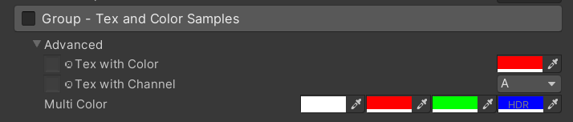

#### Ramp

##### ShaderLab

```c#
/// Draw an unreal style Ramp Map Editor (Default Ramp Map Resolution: 256 * 2)
/// NEW: The new LwguiGradient type has both the Gradient and Curve editors, and can be used in C# scripts and runtime, and is intended to replace UnityEngine.Gradient
///
/// group: parent group name (Default: none)
/// defaultFileName: default Ramp Map file name when create a new one (Default: RampMap)
/// rootPath: the path where ramp is stored, replace '/' with '.' (for example: Assets.Art.Ramps). when selecting ramp, it will also be filtered according to the path (Default: Assets)
/// colorSpace: switch sRGB / Linear in ramp texture import setting (Default: sRGB)
/// defaultWidth: default Ramp Width (Default: 256)
/// viewChannelMask: editable channels. (Default: RGBA)
/// timeRange: the abscissa display range (1/24/2400), is used to optimize the editing experience when the abscissa is time of day. (Default: 1)
/// Target Property Type: Texture2D
public RampDrawer() : this(String.Empty) { }
public RampDrawer(string group) : this(group, "RampMap") { }
public RampDrawer(string group, string defaultFileName) : this(group, defaultFileName, DefaultRootPath, 256) { }
public RampDrawer(string group, string defaultFileName, float defaultWidth) : this(group, defaultFileName, DefaultRootPath, defaultWidth) { }
public RampDrawer(string group, string defaultFileName, string rootPath, float defaultWidth) : this(group, defaultFileName, rootPath, "sRGB", defaultWidth) { }
public RampDrawer(string group, string defaultFileName, string rootPath, string colorSpace, float defaultWidth) : this(group, defaultFileName, rootPath, colorSpace, defaultWidth, "RGBA") { }
public RampDrawer(string group, string defaultFileName, string rootPath, string colorSpace, float defaultWidth, string viewChannelMask) : this(group, defaultFileName, rootPath, colorSpace, defaultWidth, viewChannelMask, 1) { }
public RampDrawer(string group, string defaultFileName, string rootPath, string colorSpace, float defaultWidth, string viewChannelMask, float timeRange)
```

Example:

```c#
[Ramp(_, RampMap, Assets.Art, 512)] _Ramp ("Ramp Map", 2D) = "white" { }
```

Result:

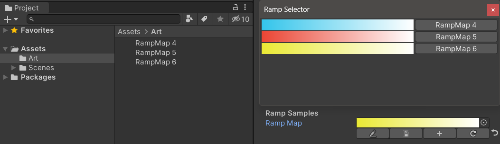

你**必须手动保存编辑结果**, 如果有未保存的修改, Save按钮将显示黄色.

**在你移动或者复制RampMap的时候, 切记要连同.meta文件一起移动, 否则将无法再次编辑!**

##### C#

Example:

```c#
public class Test : MonoBehaviour
{
    public LwguiGradient lwguiGradientSrgb = new LwguiGradient();

    [LwguiGradientUsage(ColorSpace.Linear, LwguiGradient.ChannelMask.RGB, LwguiGradient.GradientTimeRange.TwentyFourHundred)]
    public LwguiGradient lwguiGradientLinear = new LwguiGradient();
}
```

Result:

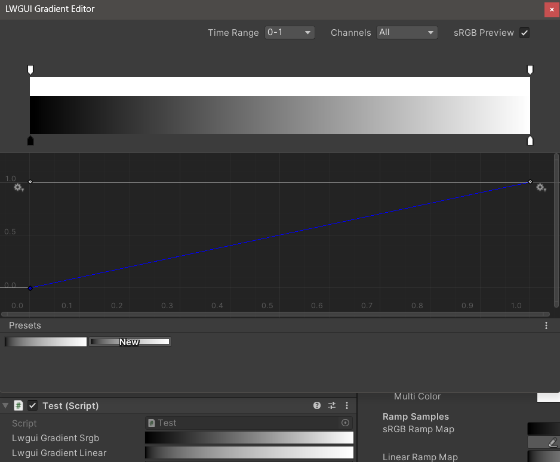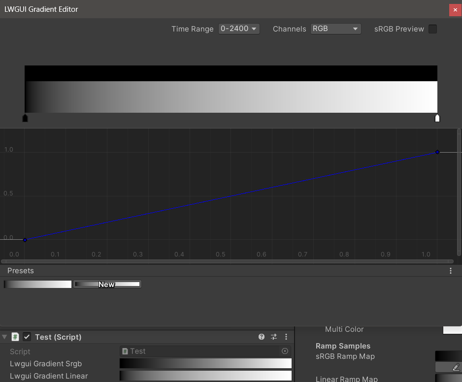

可以使用LwguiGradientUsage() Attribute设置默认的显示设置.

##### Gradient Editor

新的LWGUI Gradient Editor集成了Unity内置的[Gradient Editor](https://docs.unity3d.com/Manual/EditingValueProperties.html)和[Curve Editor](https://docs.unity3d.com/Manual/EditingCurves.html), 实现了比UE的Gradient Editor更加强大的功能.

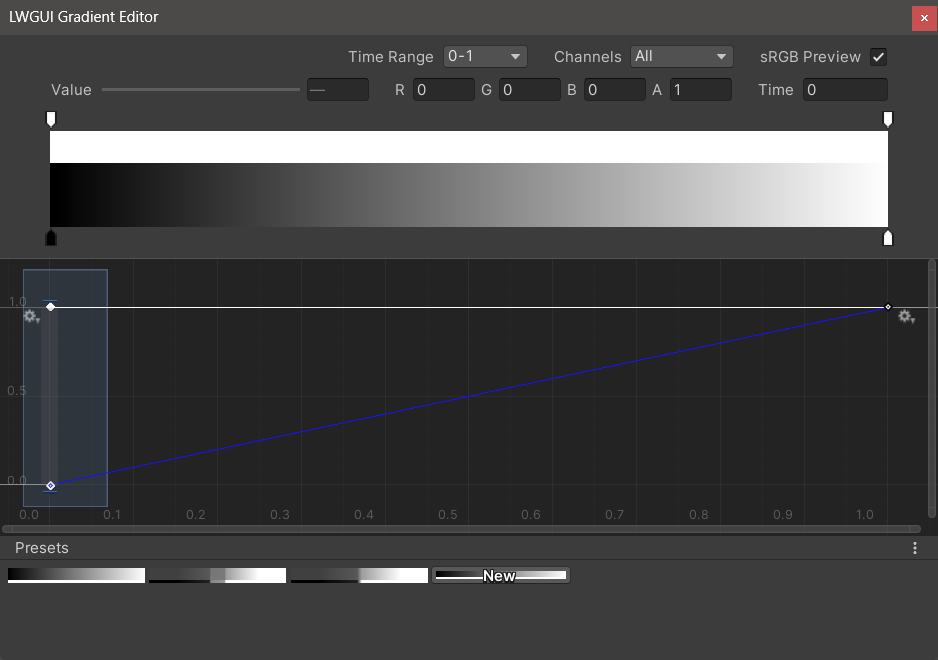

| 编辑器                | 解释                                                                                                                                                                                                                                                                                       |
| --------------------- | ------------------------------------------------------------------------------------------------------------------------------------------------------------------------------------------------------------------------------------------------------------------------------------------ |
| Time Range            | 横轴的显示范围, 可以选择0-1 / 0-24 / 0-2400, 当横轴为时间时非常有用. 注意, 只影响显示, 横轴实际存储的值始终为0-1.                                                                                                                                                                          |
| Channels              | 显示的通道, 可以单独只显示某些通道.                                                                                                                                                                                                                                                        |
| sRGB Preview          | 当Gradient的值为颜色时应该勾选以预览正确的颜色, 否则不需要勾选. 只影响显示, Gradient和Ramp Map存储的值始终为Linear.                                                                                                                                                                        |
| Value / R / G / B / A | 用于编辑已选中的Key的Value, 可以同时编辑多个Key的Value.                                                                                                                                                                                                                                    |
| Time                  | 用于编辑已选中的Key的Time, 可以同时编辑多个Key的Time. 如果手动输入数字, 必须要**按回车**以结束编辑.                                                                                                                                                                                  |
| Gradient Editor       | 类似于Unity内置的[Gradient Editor](https://docs.unity3d.com/Manual/EditingValueProperties.html), 但是将Alpha通道分离显示为黑白.``注意, **从Gradient Editor添加Key时会受到最多8个Key的限制**, 从Curve Editor添加Key则数量**不受限制**. Key的数量超过限制不会影响预览和使用. |
| Curve Editor          | 类似于Unity内置的Curve Editor, 默认显示XY 0-1的范围, 你可以用滚轮缩放或移动显示范围.``如下图所示, 右键菜单中有大量控制曲线形态的功能, 你可以查阅[Unity文档](https://docs.unity3d.com/Manual/EditingCurves.html)以充分利用这些功能.                                                     |
| Presets               | 你可以保存当前LWGUI Gradient为预设, 并随时调用这些预设. 这些预设在本地计算机的不同引擎版本之间通用, 但不会保存到项目中.                                                                                                                                                                    |

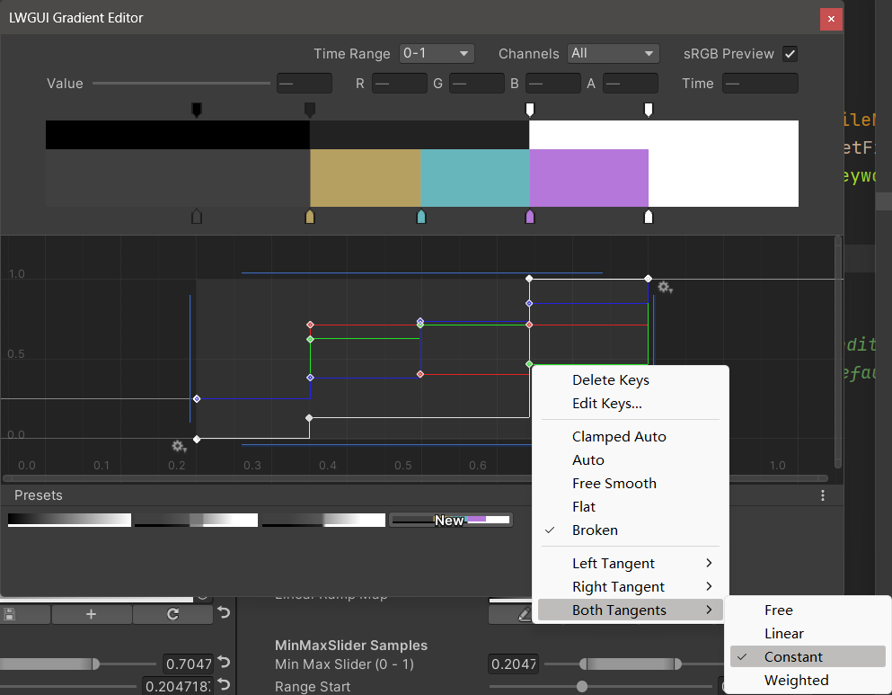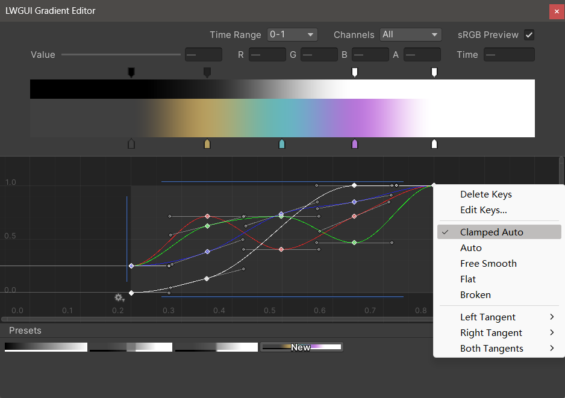

> [!NOTE]
> **已知问题:**
>
> - Unity 2022以下的预览图像在sRGB/Linear颜色空间之间没有区别
> - 在编辑器帧率较低时Ctrl + Z结果可能和预期稍有偏差

#### RampAtlas

```c#
/// 绘制一个"Ramp Atlas Scriptable Object"选择器和贴图预览.  
/// Ramp Atlas SO负责存储多个Ramp并生成对应的Ramp Atlas Texture.  
/// 与RampAtlasIndexer()一起使用, 以在Shader中使用Index采样特定Ramp, 类似于UE的Curve Atlas.  
/// 注意: 目前材质球仅保存Texture引用和Int值, 如果你手动修改了Ramp Atlas则不会自动更新引用!  
///  
/// group: parent group name (Default: none)
/// defaultFileName: the default file name when creating a Ramp Atlas SO (Default: RampAtlas)
/// rootPath: the default directory when creating a Ramp Atlas SO, replace '/' with '.' (for example: Assets.Art.RampAtlas). (Default: Assets)
/// colorSpace: the Color Space of Ramp Atlas Texture. (sRGB/Linear) (Default: sRGB)
/// defaultWidth: default Ramp Atlas Texture width (Default: 256)
/// defaultHeight: default Ramp Atlas Texture height (Default: 4)
/// showAtlasPreview: Draw the preview of Ramp Atlas below (True/False) (Default: True)
/// rampAtlasTypeName: custom RampAtlas type name for user-defined RampAtlas classes (Default: LwguiRampAtlas)
/// Target Property Type: Texture2D
public RampAtlasDrawer() : this(string.Empty) { }  
public RampAtlasDrawer(string group) : this(group, "RampAtlas") { }  
public RampAtlasDrawer(string group, string defaultFileName) : this(group, defaultFileName, "Assets") { }  
public RampAtlasDrawer(string group, string defaultFileName, string rootPath) : this(group, defaultFileName, rootPath, "sRGB") { }  
public RampAtlasDrawer(string group, string defaultFileName, string rootPath, string colorSpace) : this(group, defaultFileName, rootPath, colorSpace, 256) { } 
public RampAtlasDrawer(string group, string defaultFileName, string rootPath, string colorSpace, float defaultWidth) : this(group, defaultFileName, rootPath, colorSpace, defaultWidth, 4) { }  
public RampAtlasDrawer(string group, string defaultFileName, string rootPath, string colorSpace, float defaultWidth, float defaultHeight) : this(group, defaultFileName, rootPath, colorSpace, defaultWidth, defaultHeight, "true") { }  
public RampAtlasDrawer(string group, string defaultFileName, string rootPath, string colorSpace, float defaultWidth, float defaultHeight, string showAtlasPreview) : this(group, defaultFileName, rootPath, colorSpace, defaultWidth, defaultHeight, showAtlasPreview, "") { }  
public RampAtlasDrawer(string group, string defaultFileName, string rootPath, string colorSpace, float defaultWidth, float defaultHeight, string showAtlasPreview, string rampAtlasTypeName)
```

Example:

```c#
[RampAtlas(g2)] _RampAtlas ("Ramp Atlas", 2D) = "white" { }  
[Space]  
[RampAtlasIndexer(g2, _RampAtlas, Default Ramp)] _RampAtlasIndex0 ("Indexer", float) = 0  
[RampAtlasIndexer(g2, _RampAtlas, Default Ramp)] _RampAtlasIndex1 ("Indexer", float) = 1  
[RampAtlasIndexer(g2, _RampAtlas, Green, Linear, GA, 24)] _RampAtlasIndex2 ("Indexer Linear/Green/24", float) = 3
```

Result:


Shaderlab:

```c#
sampler2D _RampAtlas;  
float4 _RampAtlas_TexelSize;  
int _RampAtlasIndex0;

......

float2 rampUV = float2(i.uv.x, _RampAtlas_TexelSize.y * (_RampAtlasIndex0 + 0.5f));  
fixed4 color = tex2D(_RampAtlas, saturate(rampUV));
```

##### Ramp Atlas Scriptable Object

Ramp Atlas SO负责存储并生成Ramp Atlas Texture:

在加载SO或在材质上修改Ramp时, 会自动在与SO相同路径处创建Ramp Atlas Texture, 后缀名为 `.tga`.
在手动修改SO后需要点击 `Save Texture Toggle`生成Texture.

你可以用以下方式创建SO:

- 在Project面板中右键: `Create > LWGUI > Ramp Atlas`
- 在使用RampAtlas()的材质属性上右键: `Create Ramp Atlas`或 `Clone Ramp Atlas`
  - 用这种方式创建的SO会包含当前材质中所有Ramp的默认值

你可以点击RampAtlasIndexer()的添加按钮向SO添加新的Ramp.

右上角的上下文菜单中有一键转换颜色空间功能.

> [!CAUTION]
> 目前材质仅保存Texture引用和Int值, 如果你手动修改了Ramp Atlas SO中的Ramp数量和顺序, 那么材质中已选择的Ramp可能被打乱!
>
> 建议:
>
> - 缩小单个Ramp Atlas的使用范围
> - 只添加Ramp
> - 不要修改Ramp排序

#### Image

```c#
/// Draw an image preview.
/// display name: The path of the image file relative to the Unity project, such as: "assets~/test.png", "Doc/test.png", "../test.png"
/// 
/// group: parent group name (Default: none)
/// Target Property Type: Any
public ImageDrawer() { }
public ImageDrawer(string group)
```

Result:

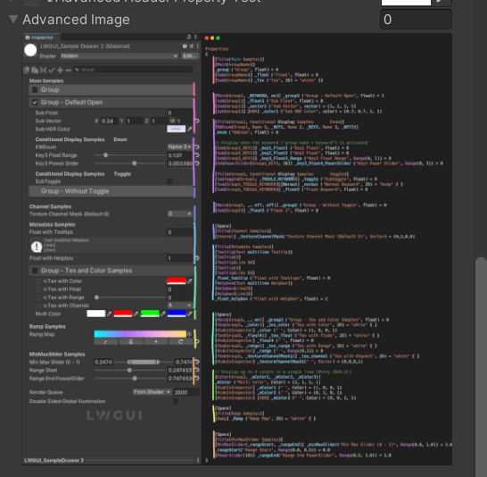

### Vector

#### Color

```c#
/// Display up to 4 colors in a single line
/// 
/// group: parent group name (Default: none)
/// color2-4: extra color property name
/// Target Property Type: Color
public ColorDrawer(string group, string color2) : this(group, color2, String.Empty, String.Empty) { }
public ColorDrawer(string group, string color2, string color3) : this(group, color2, color3, String.Empty) { }
public ColorDrawer(string group, string color2, string color3, string color4)

```

Example:

```c#
[Main(Group3, _, on)] _group3 ("Group - Tex and Color Samples", float) = 0
[Tex(Group3, _color)] _tex_color ("Tex with Color", 2D) = "white" { }
[HideInInspector] _color (" ", Color) = (1, 0, 0, 1)
[Tex(Group3, _textureChannelMask1)] _tex_channel ("Tex with Channel", 2D) = "white" { }
[HideInInspector] _textureChannelMask1(" ", Vector) = (0,0,0,1)

// Display up to 4 colors in a single line
[Color(Group3, _mColor1, _mColor2, _mColor3)]
_mColor ("Multi Color", Color) = (1, 1, 1, 1)
[HideInInspector] _mColor1 (" ", Color) = (1, 0, 0, 1)
[HideInInspector] _mColor2 (" ", Color) = (0, 1, 0, 1)
[HideInInspector] [HDR] _mColor3 (" ", Color) = (0, 0, 1, 1)

```

Result:


#### Channel

```c#
/// Draw a R/G/B/A drop menu:
/// 	R = (1, 0, 0, 0)
/// 	G = (0, 1, 0, 0)
/// 	B = (0, 0, 1, 0)
/// 	A = (0, 0, 0, 1)
/// 	RGB Average = (1f / 3f, 1f / 3f, 1f / 3f, 0)
/// 	RGB Luminance = (0.2126f, 0.7152f, 0.0722f, 0)
///		None = (0, 0, 0, 0)
/// 
/// group: parent group name (Default: none)
/// Target Property Type: Vector, used to dot() with Texture Sample Value
public ChannelDrawer() { }
public ChannelDrawer(string group)
```

Example:

```c#
[Title(_, Channel Samples)]
[Channel(_)]_textureChannelMask("Texture Channel Mask (Default G)", Vector) = (0,1,0,0)

......

float selectedChannelValue = dot(tex2D(_Tex, uv), _textureChannelMask);
```

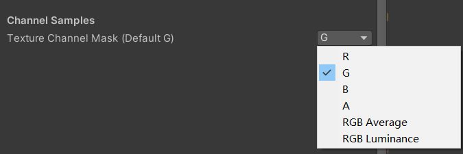

### Other

#### Button

```c#
/// Draw one or more Buttons within the same row, using the Display Name to control the appearance and behavior of the buttons
/// 
/// Declaring a set of Button Name and Button Command in Display Name generates a Button, separated by '@':
/// ButtonName0@ButtonCommand0@ButtonName1@ButtonCommand1
/// 
/// Button Name can be any other string, the format of Button Command is:
/// TYPE:Argument
/// 
/// The following TYPEs are currently supported:
/// - URL: Open the URL, Argument is the URL
/// - C#: Call the public static C# function, Argument is NameSpace.Class.Method(arg0, arg1, ...),
///		for target function signatures, see: LWGUI.ButtonDrawer.TestMethod().
///
/// The full example:
/// [Button(_)] _button0 ("URL Button@URL:https://github.com/JasonMa0012/LWGUI@C#:LWGUI.ButtonDrawer.TestMethod(1234, abcd)", Float) = 0
/// 
/// group: parent group name (Default: none)
/// Target Property Type: Any
public ButtonDrawer() { }
public ButtonDrawer(string group)
```

Example:

```c#
[Title(Button Samples)]
[Button(_)] _button0 ("URL Button@URL:https://github.com/JasonMa0012/LWGUI@C# Button@C#:LWGUI.ButtonDrawer.TestMethod(1234, abcd)", Float) = 0

```

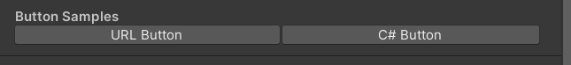

## Extra Decorators

### Appearance

#### Title & SubTitle

```c#
/// <summary>
/// Similar to Header()
/// 
/// group: parent group name (Default: none)
/// header: string to display, "SpaceLine" or "_" = none (Default: none)
/// height: line height (Default: 22)
public TitleDecorator(string header) : this("_", header, DefaultHeight) {}
public TitleDecorator(string header, float  height) : this("_", header, height) {}
public TitleDecorator(string group,  string header) : this(group, header, DefaultHeight) {}
public TitleDecorator(string group, string header, float height)


/// Similar to Title()
/// 
/// group: parent group name (Default: none)
/// header: string to display, "SpaceLine" or "_" = none (Default: none)
/// height: line height (Default: 22)
public SubTitleDecorator(string group,  string header) : base(group, header, DefaultHeight) {}
public SubTitleDecorator(string group, string header, float height) : base(group, header, height) {}

```

#### Tooltip & Helpbox

```c#
/// Tooltip, describes the details of the property. (Default: property.name and property default value)
/// You can also use "#Text" in DisplayName to add Tooltip that supports Multi-Language.
/// 
/// tooltip: a single-line string to display, support up to 4 ','. (Default: Newline)
public TooltipDecorator() : this(string.Empty) {}
public TooltipDecorator(string tooltip) { this._tooltip = tooltip; }
public TooltipDecorator(string s1, string s2) : this(s1 + ", " + s2) { }
public TooltipDecorator(string s1, string s2, string s3) : this(s1 + ", " + s2 + ", " + s3) { }
public TooltipDecorator(string s1, string s2, string s3, string s4) : this(s1 + ", " + s2 + ", " + s3 + ", " + s4) { }
public TooltipDecorator(string s1, string s2, string s3, string s4, string s5) : this(s1 + ", " + s2 + ", " + s3 + ", " + s4 + ", " + s5) { }


```

```c#
/// Display a Helpbox on the property
/// You can also use "%Text" in DisplayName to add Helpbox that supports Multi-Language.
/// 
/// message: a single-line string to display, support up to 4 ','. (Default: Newline)
public HelpboxDecorator() : this(string.Empty) {}
public HelpboxDecorator(string message) { this._message = message; }
public HelpboxDecorator(string s1, string s2) : this(s1 + ", " + s2) { }
public HelpboxDecorator(string s1, string s2, string s3) : this(s1 + ", " + s2 + ", " + s3) { }
public HelpboxDecorator(string s1, string s2, string s3, string s4) : this(s1 + ", " + s2 + ", " + s3 + ", " + s4) { }
public HelpboxDecorator(string s1, string s2, string s3, string s4, string s5) : this(s1 + ", " + s2 + ", " + s3 + ", " + s4 + ", " + s5) { }


```

Example:

```c#
[Title(Metadata Samples)]
[Tooltip(Test multiline Tooltip, a single line supports up to 4 commas)]
[Tooltip()]
[Tooltip(Line 3)]
[Tooltip(Line 4)]
_float_tooltip ("Float with Tooltips#这是中文Tooltip#これは日本語Tooltipです", float) = 1
[Helpbox(Test multiline Helpbox)]
[Helpbox(Line2)]
[Helpbox(Line3)]
_float_helpbox ("Float with Helpbox%这是中文Helpbox%これは日本語Helpboxです", float) = 1

```

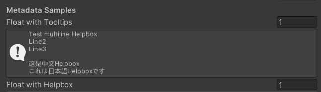

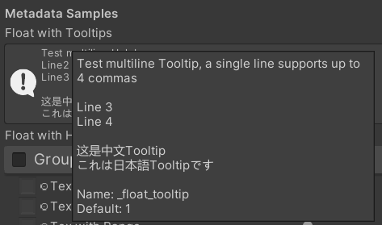

Tips:

- Tooltip可能在Editor运行时消失, 这是Unity本身的特性 (或者是bug)

#### ReadOnly

```c#
/// 将属性设为只读.
public ReadOnlyDecorator()
```

### Logic

#### PassSwitch

```c#
/// Cooperate with Toggle to switch certain Passes.
/// 
/// lightModeName(s): Light Mode in Shader Pass (https://docs.unity3d.com/2017.4/Documentation/Manual/SL-PassTags.html)
public PassSwitchDecorator(string   lightModeName1) 
public PassSwitchDecorator(string   lightModeName1, string lightModeName2) 
public PassSwitchDecorator(string   lightModeName1, string lightModeName2, string lightModeName3) 
public PassSwitchDecorator(string   lightModeName1, string lightModeName2, string lightModeName3, string lightModeName4) 
public PassSwitchDecorator(string   lightModeName1, string lightModeName2, string lightModeName3, string lightModeName4, string lightModeName5) 
public PassSwitchDecorator(string   lightModeName1, string lightModeName2, string lightModeName3, string lightModeName4, string lightModeName5, string lightModeName6) 

```

### Structure

#### Advanced & AdvancedHeaderProperty

```c#
/// Collapse the current Property into an Advanced Block.
/// Specify the Header String to create a new Advanced Block.
/// All Properties using Advanced() will be collapsed into the nearest Advanced Block.
/// 
/// headerString: The title of the Advanced Block. Default: "Advanced"
public AdvancedDecorator() : this(string.Empty) { }
public AdvancedDecorator(string headerString)
```

```c#
/// Create an Advanced Block using the current Property as the Header.
public AdvancedHeaderPropertyDecorator()
```

Example:

```c#
[Main(Group2, _, off, off)] _group2 ("Group - Without Toggle", float) = 0
[Sub(Group2)] _float3 ("Float 2", float) = 0
[Advanced][Sub(Group2)] _Advancedfloat0 ("Advanced Float 0", float) = 0
[Advanced][Sub(Group2)] _Advancedfloat1 ("Advanced Float 1", float) = 0
[Advanced(Advanced Header Test)][Sub(Group2)] _Advancedfloat3 ("Advanced Float 3", float) = 0
[Advanced][Sub(Group2)] _Advancedfloat4 ("Advanced Float 4", float) = 0
[AdvancedHeaderProperty][Tex(Group2, _Advancedfloat7)] _AdvancedTex0 ("Advanced Header Property Test", 2D) = "white" { }
[Advanced][HideInInspector] _Advancedfloat7 ("Advanced Float 7", float) = 0
[Advanced][Tex(Group2, _AdvancedRange0)] _AdvancedTex1 ("Advanced Tex 1", 2D) = "white" { }
[Advanced][HideInInspector] _AdvancedRange0 ("Advanced Range 0", Range(0, 1)) = 0

```

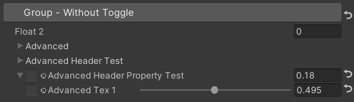

Tips:

- LWGUI使用树状数据结构存储Group和Advanced Block及其子级的关系, 理论上可以存储无限多级父子关系, 但**目前LWGUI仅手动处理3层父子关系, 也就是说你可以将Advanced Block放在Group内, 而不能将Group放在Advanced Block内.**

### Condition Display

#### Hidden

```c#
/// 类似于HideInInspector(), 区别在于Hidden()可以通过Display Mode按钮取消隐藏.
public HiddenDecorator()
```

#### ShowIf

```c#
/// Control the show or hide of a single or a group of properties based on multiple conditions.
///
/// logicalOperator: And | Or (Default: And).
/// propName: Target Property Name used for comparison.
/// compareFunction: Less (L) | Equal (E) | LessEqual (LEqual / LE) | Greater (G) | NotEqual (NEqual / NE) | GreaterEqual (GEqual / GE).
/// value: Target Property Value used for comparison.
public ShowIfDecorator(string propName, string comparisonMethod, float value) : this("And", propName, comparisonMethod, value) { }
public ShowIfDecorator(string logicalOperator, string propName, string compareFunction, float value)
```

Example:

```c#
[ShowIf(_enum, Equal, 1)]
[Title(ShowIf Main Samples)]
[Main(GroupName)] _group ("Group", float) = 0
[Sub(GroupName)] _float ("Float", float) = 0
[Sub(GroupName)] _Tex ("Tex", 2D) = "white" { }

...

[SubTitle(Group1, Conditional Display Samples       Enum)]
[KWEnum(Group1, Name 1, _KEY1, Name 2, _KEY2, Name 3, _KEY3)] _enum ("KWEnum", float) = 0
[Sub(Group1)][ShowIf(_enum, Equal, 0)] _key1_Float1 ("Key1 Float", float) = 0
[Sub(Group1)][ShowIf(_enum, Equal, 1)] _key2_Float2 ("Key2 Float", float) = 0
[SubIntRange(Group1)][ShowIf(_enum, Equal, 2)] _key3_Int_Range ("Key3 Int Range", Range(0, 10)) = 0
[ShowIf(_enum, Equal, 0)][ShowIf(Or, _enum, Equal, 2)]
[SubPowerSlider(Group1, 3)] _key13_PowerSlider ("Key1 or Key3 Power Slider", Range(0, 1)) = 0

```

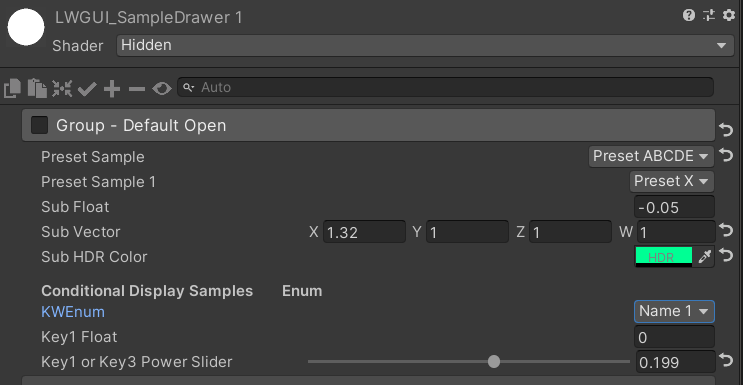

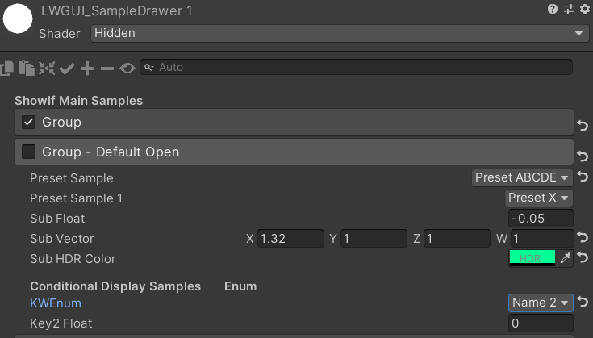

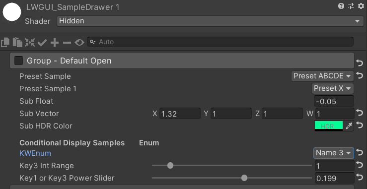

## LWGUI Timeline Tracks

### MaterialKeywordToggleTrack

录制材质参数动画时自动捕获Keyword改动并添加该轨道到Timeline Asset, 运行时根据float值设置Keyword状态.

支持带Keyword的Toggle类型的Drawer.

## Unity Builtin Drawers

### Space

```c#
MaterialSpaceDecorator(float height)
```

### Header

```c#
MaterialHeaderDecorator(string header)
```

### Enum

```c#
MaterialEnumDrawer(string n1, float v1, string n2, float v2, string n3, float v3, string n4, float v4, string n5, float v5, string n6, float v6, string n7, float v7)
```

### IntRange

```c#
MaterialIntRangeDrawer()
```

### KeywordEnum

```c#
MaterialKeywordEnumDrawer(string kw1, string kw2, string kw3, string kw4, string kw5, string kw6, string kw7, string kw8, string kw9)
```

### PowerSlider

```c#
MaterialPowerSliderDrawer(float power)
```

### Toggle

```c#
MaterialToggleUIDrawer(string keyword)
```

## FAQs

### 在代码中修改材质后出现问题

在代码中修改材质属性后, Drawer逻辑不会运行, 可能会丢失一些数据 (例如Keywords).
你需要手动调用 `LWGUI.UnityEditorExtension.ApplyMaterialPropertyAndDecoratorDrawers()`以设置这部分数据 (实际上会调用 `MaterialPropertyDrawer.Apply()`).

### 在代码中创建材质后出现问题

在代码中创建材质时部分Drawer逻辑不会运行, 默认值可能不符合预期.
你需要手动调用 `LWGUI.PresetHelper.ApplyPresetsInMaterial()`以确保默认值正确.

## Custom Shader GUI

### Custom Header and Footer

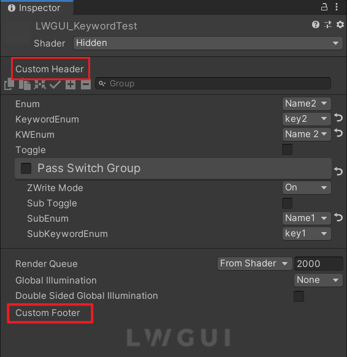

Custom Header和Footer可以让你无需修改LWGUI插件的代码即可在ShaderGUI的顶部或底部添加自定义的模块.

1. 根据你要添加自定义GUI的位置复制以下脚本到你的项目某个Editor文件夹中:
   - 顶部: Packages/com.jasonma.lwgui/Editor/CustomGUISample/CustomHeader.cs
   - 底部: Packages/com.jasonma.lwgui/Editor/CustomGUISample/CustomFooter.cs
2. 修改文件名和类名
3. 在DoCustomHeader() / DoCustomFooter()中添加你自定义的GUI代码
4. 建议查看lwgui对象的定义以获取你所需要的数据

### Custom Drawer

你可以通过继承 `SubDrawer` 来实现新的 Drawer 或 Decorator 逻辑(本项目中的 Decorator 也属于 `SubDrawer` 体系), 建议遵循以下最佳实践:

1. **先定义职责边界**
   - Drawer 负责属性输入与可视化交互.
   - Decorator 负责结构组织、显示控制或外观增强.
   - 避免在一个 Drawer 中混入过多无关职责.
2. **从最小闭环开始迭代**
   - 先实现一个最小可用版本, 再逐步补充高级能力.
   - 优先参考 `Editor/ShaderDrawers/ExtraDrawers/` 与 `Editor/ShaderDrawers/ExtraDecorators/` 中最接近的实现.
3. **保证逻辑幂等与低副作用**
   - `OnGUI` 可能高频触发, 避免重复分配和不必要写操作.
   - 仅在确实发生值变化时才写回材质或触发联动.
4. **正确使用缓存作用域**
   - Inspector 临时态放在 `PerInspectorData`.
   - 材质相关状态放在 `PerMaterialData`.
   - 可跨材质复用的 Shader 解析结果放在 `PerShaderData`.
5. **优先复用现有 Helper 能力**
   - 对于上下文菜单、Ramp、Preset、Toolbar 等需求, 优先接入 `Editor/Helper/` 的现有工具, 避免重复造轮子.
6. **兼容真实生产场景**
   - 至少验证多材质编辑、Undo/Redo、资源重导入、脚本重编译后的行为一致性.
   - 提交前使用 `Test/` 下示例资源回归主要路径.

## Contribution

1. 使用不同Unity版本创建多个空工程
2. 拉取repo
3. 使用符号链接将此repo放到所有工程的Assets或Packages目录内
4. 在 `ShaderDrawer.cs`内继承 `SubDrawer`开始开发你的自定义Drawer
5. 检查功能在不同Unity版本是否正常
6. Pull requests

## 开发指南

### 项目定位与核心目标

LWGUI 的目标是在 Unity Inspector 中, 将 Shader 属性从“线性参数列表”升级为“可分组、可条件显示、可扩展交互”的编辑体验。

它以 `ShaderGUI` 为入口, 通过属性标签与自定义规则把不同属性分发给对应 Drawer/Decorator, 并借助 Helper 与 MetaData 管理状态、缓存和资源联动。

### 架构与分层原理

整体可理解为三层:

1. **Editor 层(核心能力)**
   - 负责 Inspector 绘制、属性解析、UI 交互、菜单行为、状态缓存、资产同步。
   - 主要目录: `Editor/`
2. **Runtime 层(运行时补充)**
   - 提供少量可在运行时复用的数据结构与 Timeline 相关功能。
   - 主要目录: `Runtime/`
3. **UnityEditorExtension 层(编辑器增强)**
   - 放置附加编辑器窗口和扩展工具, 如 `LwguiGradientEditor`。
   - 主要目录: `UnityEditorExtension/`

核心调用链可概括为:

1. `Editor/LWGUI.cs` 接管材质 Inspector 绘制入口。
2. 解析 Shader 属性、MaterialProperty 与标签信息。
3. 将属性分发给 `ShaderDrawers` / `BasicDrawers` / `ExtraDrawers` / `ExtraDecorators`。
4. 在绘制过程中通过 `Helper` 处理上下文菜单、Ramp/Preset/Toolbar 等跨模块行为。
5. 通过 `MetaData` 维护跨帧、跨材质、跨 Shader 的状态作用域。
6. 由 `AssetProcessor` 与 `ScriptableObject` 处理资源导入、引用同步、图集维护等生命周期事件。

### 代码结构与职责总览

- `Editor/LWGUI.cs`
  - ShaderGUI 主入口, 组织一次 Inspector 绘制流程与各阶段事件。
- `Editor/ShaderDrawerBase.cs`
  - Drawer 基类与通用能力, 定义扩展点与基础契约。
- `Editor/BasicDrawers/`
  - 基础结构 Drawer, 如折叠组、子项容器等。
- `Editor/ShaderDrawers/`
  - Shader 属性级绘制器, 处理属性到 UI 的核心映射。
- `Editor/ShaderDrawers/ExtraDrawers/`
  - 额外类型 Drawer, 如 Numeric/Texture/Vector/Other。
- `Editor/ExtraDecorators/`
  - 装饰器能力, 包括显示样式、条件显示、逻辑控制、结构组织。
- `Editor/Helper/`
  - 跨模块工具集, 如 `ContextMenuHelper`、`RampHelper`、`PresetHelper`、`ToolbarHelper`。
- `Editor/MetaData/`
  - 缓存与状态域管理, 分层处理 Inspector/Material/Shader 维度数据。
- `Editor/ScriptableObject/`
  - 资源数据定义, 如 `LwguiRampAtlas`、`LwguiShaderPropertyPreset`、`GradientObject`。
- `Editor/AssetProcessor/`
  - 处理资产导入、改名、变更监听, 保证编辑器逻辑与资源状态一致。
- `Editor/Timeline/` 与 `Runtime/Timeline/`
  - Timeline 相关编辑器与运行时能力。
- `Runtime/LwguiGradient/`
  - 运行时可用的渐变数据结构与相关逻辑。
- `Test/`
  - 回归和示例资源(Shader/Material/Preset), 用于验证主要路径。

### MetaData 详细说明: 数据结构与生命周期

`Editor/MetaData/` 的核心目的是“避免状态串扰并减少重复计算”, 通过不同作用域隔离缓存。

#### 1) PerInspectorData (Inspector 作用域)

- 作用域: 单个 Inspector 窗口/会话内。
- 典型用途:
  - UI 折叠展开状态。
  - 临时交互态(当前编辑目标、当前菜单上下文等)。
  - 本次绘制周期可复用的瞬时缓存。
- 生命周期:
  - Inspector 首次绘制时初始化。
  - 每次 `OnGUI` 过程中读写更新。
  - Inspector 销毁、重载或上下文变化时释放/重建。
- 设计意义:
  - 避免不同 Inspector 实例互相污染状态。

#### 2) PerMaterialData (Material 作用域)

- 作用域: 单个 Material 资产(或实例)维度。
- 典型用途:
  - 与具体材质强相关的缓存结果。
  - 针对材质属性计算出的派生信息。
  - 材质级别的 UI 辅助状态。
- 生命周期:
  - 材质首次被 Inspector/工具访问时创建。
  - 在材质属性变更、重导入、替换 Shader 时刷新关键字段。
  - 材质失效、移除引用或缓存清理策略触发时回收。
- 设计意义:
  - 保证同一 Shader 的不同材质不会共享错误状态。

#### 3) PerShaderData (Shader 作用域)

- 作用域: 单个 Shader 维度, 被多个材质共享。
- 典型用途:
  - Shader 属性元信息解析缓存(属性列表、标签解析结果、分组结构等)。
  - 与 Shader 文本/结构相关且可复用的静态或半静态数据。
- 生命周期:
  - Shader 首次被使用时构建缓存。
  - Shader 重新导入、源码变化或相关依赖更新时失效重建。
  - 编辑器域重载后按需懒重建。
- 设计意义:
  - 减少重复解析成本, 提升大材质集场景下的 Inspector 性能。

#### MetaData 整体生命周期流转(推荐理解模型)

1. **进入 Inspector**
   - 定位当前材质与 Shader, 获取/创建 `PerInspectorData`、`PerMaterialData`、`PerShaderData`。
2. **绘制阶段**
   - Drawer/Decorator 读取对应作用域数据, 执行条件显示、结构布局和交互逻辑。
3. **交互与修改阶段**
   - 用户修改属性后, 写回材质并更新必要缓存; 需要时触发上下文工具或资源逻辑。
4. **资产变化阶段**
   - 若 Shader/材质/关联资源发生导入或结构变化, 由监听逻辑使相关缓存失效并重建。
5. **退出或重载阶段**
   - Inspector 级临时状态释放; 材质/Shader 级缓存按策略保留或清理。

该分层设计的关键收益:

- 状态隔离清晰, 降低“跨材质污染”“跨 Inspector 串态”风险。
- 缓存粒度合理, 在正确性与性能间保持平衡。
- 便于排查: 可按 `Inspector -> Material -> Shader` 三层顺序定位问题。

### ShaderGUI 重要事件与调用时机

以下描述按 Unity Inspector 常见生命周期理解, 便于排查时对照:

1. **入口阶段(`LWGUI` 作为 `ShaderGUI` 被调用)**

   - 当材质在 Inspector 中被选中并需要重绘时触发。
   - 典型动作: 建立上下文、准备属性列表、拉取 MetaData。
2. **OnGUI 主绘制阶段**

   - 每次 Inspector Repaint / Layout / 交互事件中都会进入。
   - 典型动作:
     - 解析并遍历 `MaterialProperty`。
     - 调用各类 Drawer/Decorator 完成结构与控件绘制。
     - 根据条件装饰器决定显示/隐藏和禁用态。
3. **属性变更检测与写回阶段**

   - 在 GUI 变更检查通过后触发。
   - 典型动作:
     - 将新值写回材质属性。
     - 触发关键字、依赖属性、联动逻辑刷新。
     - 更新 `PerMaterialData` 相关缓存。
4. **上下文行为阶段(菜单/工具条/快捷动作)**

   - 用户打开右键菜单或触发工具条功能时触发。
   - 典型动作:
     - 走 `ContextMenuHelper`、`ToolbarHelper`、`RampHelper`、`PresetHelper` 的逻辑路径。
     - 可能引发资源引用更新、预设应用或图集操作。
5. **资源生命周期联动阶段(导入/改名/重建)**

   - 当 Shader、贴图、预设、ScriptableObject 等相关资产变化时触发。
   - 典型动作:
     - `AssetProcessor` 响应变化并同步引用关系。
     - 标记并重建受影响的 `PerShaderData` / `PerMaterialData`。
6. **域重载与重初始化阶段**

   - 脚本重编译、进入/退出 PlayMode(视配置)后发生。
   - 典型动作:
     - 静态缓存失效或重置。
     - 下一次 Inspector 绘制时按需懒初始化。

### 排查建议(按调用时序)

- **显示不正确/分组错乱**: 优先看 `LWGUI.cs` 与对应 Drawer/Decorator 的分发路径。
- **菜单/工具行为异常**: 重点检查 `Editor/Helper/` 下具体 Helper 的触发条件和副作用。
- **状态串扰或缓存过期**: 先确认 `MetaData` 作用域是否选对, 再看失效时机是否遗漏。
- **资源变更后失效**: 检查 `AssetProcessor` 与 `ScriptableObject` 的引用同步链路。
